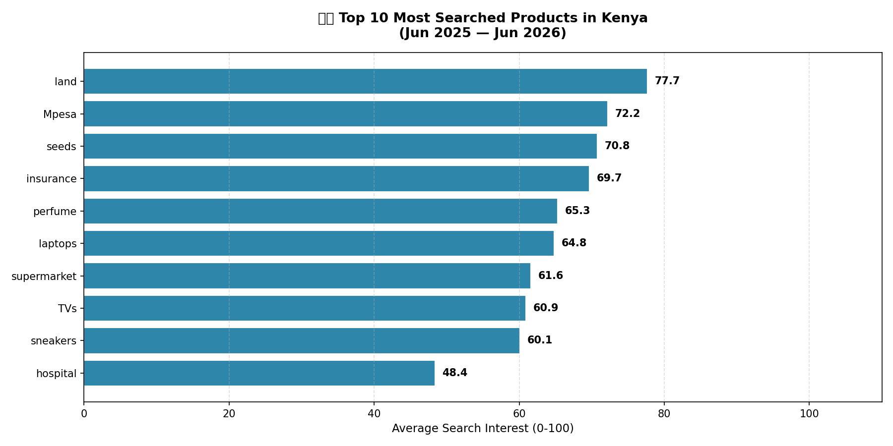
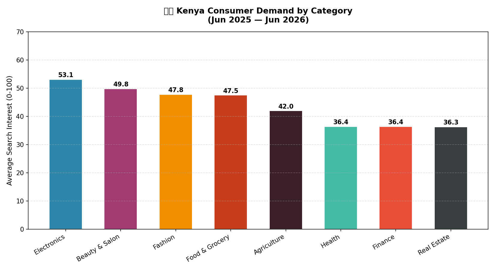
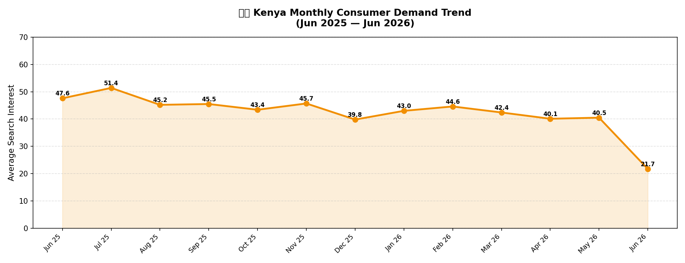
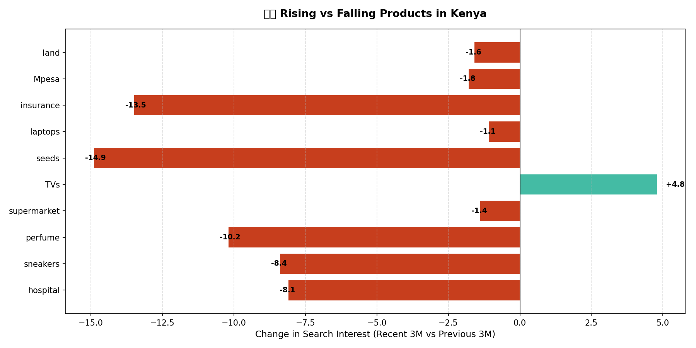

# 🇰🇪 Kenya Consumer Demand Analysis

> A full end-to-end data analysis pipeline tracking real-time consumer demand across the Kenyan market using Google Trends, Python, and PostgreSQL.

---

## 📊 Project Overview

This project answers the question:
**"What are Kenyans actively searching for — and what does that tell us about market demand?"**

Using Google Trends data, this pipeline tracks **40 keywords across 8 industries** over a 12-month period and stores results in a PostgreSQL database for SQL analysis and visualization.

---

## 🔑 Key Findings

| Rank | Product | Avg Interest |
|------|---------|-------------|
| 🥇 | Land Kenya | 77.7 |
| 🥈 | Mpesa Kenya | 72.2 |
| 🥉 | Seeds Kenya | 70.8 |
| 4 | Insurance Kenya | 69.7 |
| 5 | Laptops Kenya | 64.8 |

- 📱 **Electronics** is the top performing category (53.1 avg)
- 🛒 **November/December** is peak consumer demand season
- 📈 **TVs** is the only product with growing demand
- 🌱 **Agriculture** has huge demand but is underserved online

---

## 🛠️ Tech Stack

| Tool | Purpose |
|------|---------|
| Python 3.13 | Core programming language |
| pytrends | Google Trends API connector |
| pandas | Data cleaning & transformation |
| PostgreSQL 18 | Database storage |
| pgAdmin 4 | Database visual interface |
| SQLAlchemy | Python-PostgreSQL bridge |
| psycopg2 | Database driver |
| matplotlib | Data visualization |
| openpyxl | Excel report export |
| VS Code | Development environment |

---

## 📁 Project Structure

```
kenya_demand_analysis/
│
├── config.py          # Database credentials
├── test_connection.py # PostgreSQL connection test
├── pull_data.py       # Google Trends data pipeline
├── queries.py         # SQL analysis queries
├── visualize.py       # Chart generation
├── data/              # Raw data saves
└── outputs/           # Charts & Excel reports
    ├── top10_products.png
    ├── demand_by_category.png
    ├── monthly_trend.png
    └── rising_vs_falling.png
```

---

## 🚀 How to Run

### 1. Clone the repository
```bash
git clone https://github.com/I_am_Mwangi/kenya-demand-analysis.git
cd kenya-demand-analysis
```

### 2. Install dependencies
```bash
pip install pytrends pandas psycopg2-binary sqlalchemy matplotlib openpyxl
```

### 3. Set up PostgreSQL
- Install PostgreSQL 18 + pgAdmin 4
- Create database: `kenya_demand_analysis`
- Run the table creation SQL in pgAdmin:

```sql
CREATE TABLE IF NOT EXISTS search_trends (
    id          SERIAL PRIMARY KEY,
    date        DATE NOT NULL,
    keyword     VARCHAR(100) NOT NULL,
    interest    INTEGER,
    region      VARCHAR(50) DEFAULT 'Kenya',
    created_at  TIMESTAMP DEFAULT CURRENT_TIMESTAMP
);
```

### 4. Configure credentials
Edit `config.py`:
```python
DB_CONFIG = {
    "host"     : "localhost",
    "database" : "kenya_demand_analysis",
    "user"     : "postgres",
    "password" : "your_password",
    "port"     : "5432"
}
```

### 5. Run the pipeline
```bash
# Test connection
py test_connection.py

# Pull data from Google Trends
py pull_data.py

# Run SQL analysis
py queries.py

# Generate charts
py visualize.py
```

---

## 📈 Charts Generated

### Top 10 Most Searched Products


### Demand by Category


### Monthly Demand Trend


### Rising vs Falling Products


---

## 🔮 Next Steps

- [ ] Power BI dashboard integration
- [ ] Automated weekly data refresh (Task Scheduler)
- [ ] County-level regional breakdown
- [ ] Competitor brand tracking
- [ ] Telegram/email alert for demand spikes

---

## 👨‍💻 Author

**James Mwangi**
- Internal Auditor | EKA Hotel Eldoret
- Final Year BBIT Student | KCA University
- X: [@I_am_Mwangi](https://twitter.com/I_am_Mwangi)

---

## 📄 License

MIT License — free to use and modify.
